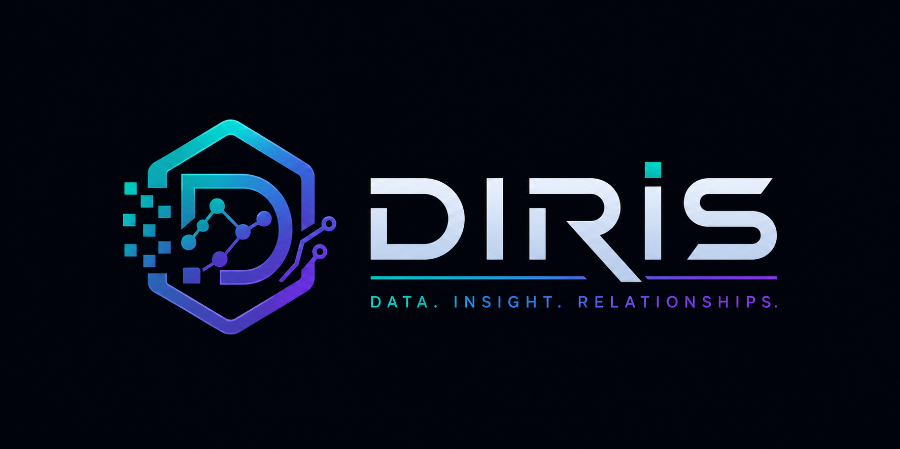
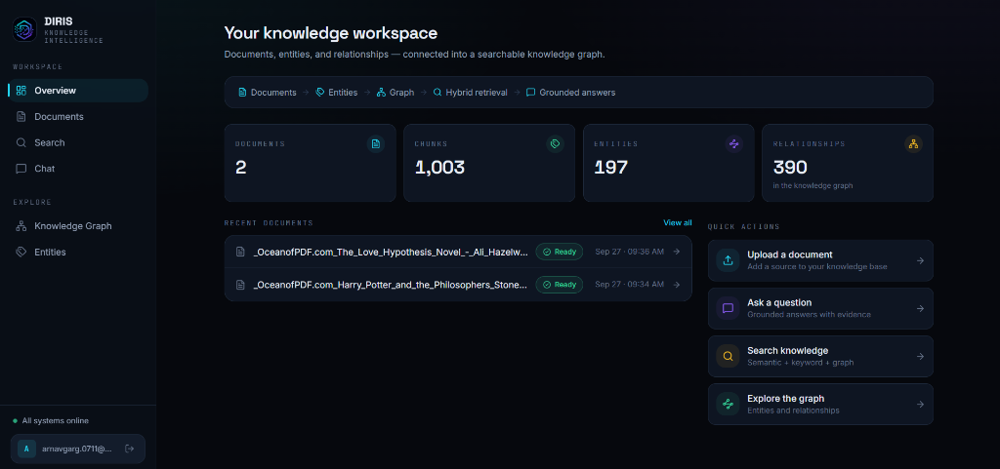
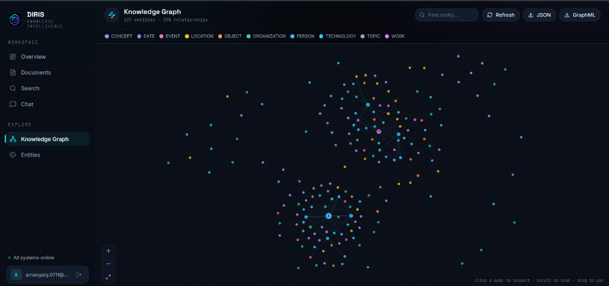
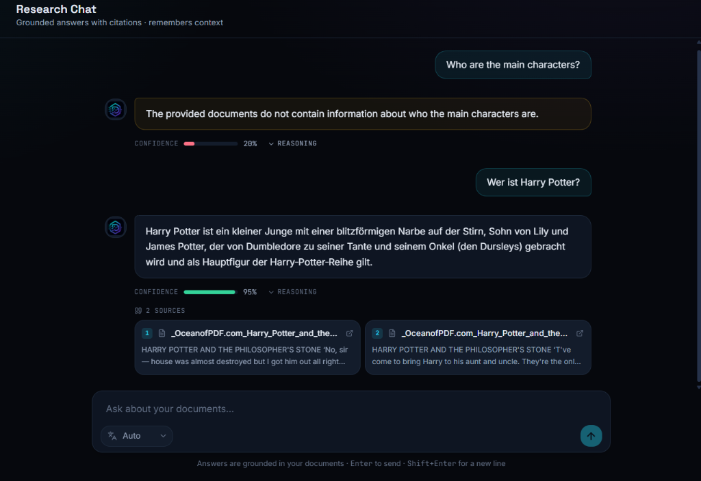
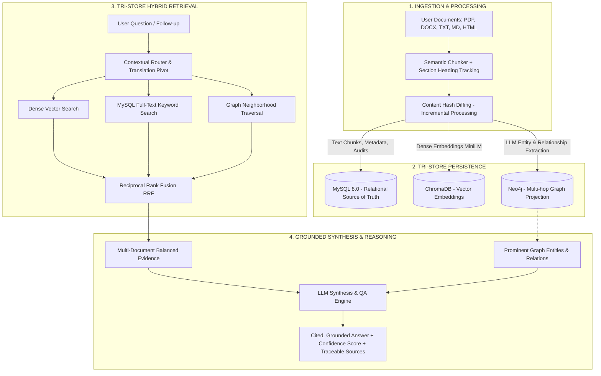

# DIRIS — Data Injection and Retrieval System

<p align="center">
  
</p>

<p align="center">
  <strong>Next-Generation Knowledge-Graph-Powered Document Intelligence & Hybrid RAG Platform</strong>
</p>

<p align="center">
  
  
  
  
  
  
  
  
</p>

---

## 🌟 Overview

**DIRIS** (*Data Injection and Retrieval System*) bridges the gap between raw unstructured documents and explainable, grounded intelligence. 

Traditional RAG systems rely solely on dense vector similarity, which frequently misses multi-hop relationships, struggles with document-wide thematic questions, and hallucinates answers. DIRIS solves this by extracting an **evolving Knowledge Graph** directly from your documents and answering queries via **Tri-Store Hybrid Retrieval** (Dense Vector + Lexical BM25 + Graph Neighborhood Traversal) fused through **Reciprocal Rank Fusion (RRF)**.

Answers are **grounded, cited, verifiable, and multilingual**, capable of performing complex synthesis (e.g. comparing literary tones, identifying key character networks) while strictly refusing to fabricate ungrounded claims.

---

## 📸 Interface Showcase

### 1. Unified Knowledge Workspace
*Central operational dashboard tracking real-time document library stats, chunk counts, extracted entities, and knowledge graph edges.*


---

### 2. Interactive Knowledge Graph Explorer
*Live projection of extracted entities (People, Locations, Concepts, Organizations) and their relationships powered by Neo4j and vis-network.*


---

### 3. Grounded Multilingual Research Chat
*Conversational intelligence featuring cited source snippets, confidence indicators, multilingual translation pivots, and culturally aware interaction.*


---

## 🏗️ System Architecture



---

## ✨ Key Features

### 🔍 Tri-Store Hybrid Retrieval (RRF)
- Combines the strengths of **ChromaDB** (semantic similarity), **MySQL Full-Text** (exact keyword matching), and **Neo4j** (entity connectivity).
- Fuses disparate retrieval scores with **Reciprocal Rank Fusion** ($RRF = \sum \frac{1}{k + r_i}$), ensuring balanced and highly relevant context retrieval.
- Automatically distributes retrieved chunks across multiple documents to empower comparative questions (e.g. comparing characters or tone across multiple books).

### 🕸️ Evolving Knowledge Graph
- Extracts typed entities (`PERSON`, `ORGANIZATION`, `LOCATION`, `CONCEPT`, `WORK`, `EVENT`, etc.) and directional evidence-backed relationships.
- Embeds entity aliases to perform **fuzzy entity resolution and deduplication**.
- Built-in visual explorer with zoom, search, cluster inspection, and export to **GraphML** and **JSON**.

### 🧠 Grounded Analytical Synthesis
- Eliminates AI hallucinations by requiring strict evidence alignment for factual claims.
- Equipped with **analytical reasoning**: can identify main character hierarchies from mention frequencies and contrast narrative tones and writing styles across documents.
- Resolves citations down to the exact document, section heading, chunk index, and character offset.

### 🌐 Multilingual & Culturally Aware
- Seamlessly answers queries across **20+ languages** (English, Hindi, German, Spanish, French, etc.) using an intelligent translation pivot.
- Recognizes cultural greetings (e.g., *Namaste*, *Pranam*) and responds with warm, appropriate etiquette in the requested language.

### ⚡ Incremental Document Processing
- SHA-256 chunk hashing diffs document updates. Re-processing only extracts and embeds **new or modified chunks**, preserving unchanged vector embeddings and graph relationships.

---

## 🛠️ Tech Stack

| Layer | Technologies | Role |
|---|---|---|
| **Frontend** | React 19, TypeScript, Vite, Tailwind CSS, vis-network, Lucide Icons | Responsive Dark-mode UI, real-time graph visualization, reactive chat |
| **Backend API** | FastAPI, Pydantic v2, SQLAlchemy 2.0, Alembic, Uvicorn | Async REST API, JWT Authentication, background tasks |
| **Relational DB** | MySQL 8.0 (PyMySQL) | Authoritative source of truth for users, documents, chunks, entities, and chats |
| **Vector DB** | ChromaDB (ONNX MiniLM) | High-performance dense embeddings store |
| **Graph DB** | Neo4j 5.x (Cypher) | Entity-relationship graph projection, multi-hop path traversal |
| **LLM Orchestration** | Groq, Google Gemini, Anthropic Claude | Automated provider fallback chain (high speed & zero-stall failover) |

---

## 🚀 Quickstart & Setup

### Prerequisites
- **Python 3.12** or **3.13**
- **Node.js 18+** & **npm**
- **Docker Desktop** (for MySQL & Neo4j)
- At least one LLM API key (**Gemini** or **Groq** free tiers work out of the box)

---

### Step 1: Clone & Configure

```bash
git clone https://github.com/ArnavGarg7/Diris.git
cd Diris

# Copy environment configuration
cp .env.example .env
```

Edit `.env` with your API key(s):
```ini
GROQ_API_KEY=gsk_your_groq_key_here
# AND/OR
GEMINI_API_KEY=your_gemini_key_here
```

---

### Step 2: Launch Databases via Docker

```bash
docker compose up -d
```
*Spins up MySQL on port `3307` and Neo4j on ports `7474` (browser) and `7687` (bolt).*

---

### Step 3: Setup Backend Virtual Environment

```powershell
# Create virtual environment
python -m venv .venv

# Activate (PowerShell on Windows)
.venv\Scripts\Activate.ps1
# (Or on Linux/macOS: source .venv/bin/activate)

# Install dependencies
pip install -r requirements-dev.txt

# Run database migrations
python -m alembic upgrade head
```

---

### Step 4: Run the Application

#### 🔹 Terminal 1: Backend
```powershell
.venv\Scripts\uvicorn.exe diris.api.main:app --host 127.0.0.1 --port 8081 --reload
```

#### 🔹 Terminal 2: Frontend
```powershell
cd frontend
npm install
npm run dev
```

---

## 📍 Service Endpoints

| Service | Address | Description |
|---|---|---|
| **Web Dashboard** | [http://localhost:5173](http://localhost:5173) | Primary React frontend |
| **API Documentation** | [http://127.0.0.1:8081/docs](http://127.0.0.1:8081/docs) | Interactive Swagger UI |
| **Neo4j Browser** | [http://localhost:7474](http://localhost:7474) | Database visualizer (`neo4j` / `dirispassword`) |
| **Health Check** | [http://127.0.0.1:8081/health](http://127.0.0.1:8081/health) | System health probe |

---

## 🧪 Testing & Evaluation

DIRIS includes a comprehensive automated test and evaluation suite:

```bash
# Run unit & integration test suite
pytest

# Code quality and linting
python -m ruff check .

# Retrieval quality benchmark (Recall@K and MRR on labeled test sets)
python -m eval.retrieval

# Hallucination benchmark (validates refusal rates on ungrounded questions)
python -m eval.hallucination
```

---

## 👤 Author

Developed with ❤️ by **[Arnav Garg](https://github.com/ArnavGarg7)**.

*For feedback, discussions, or contributions, feel free to open an issue or pull request!*
